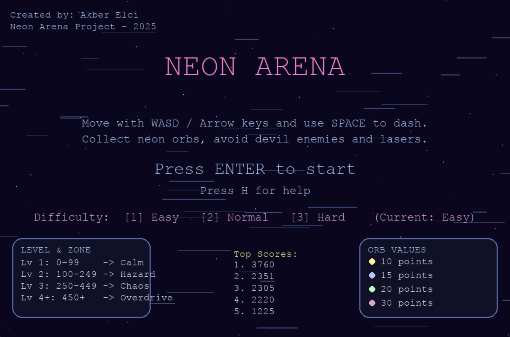
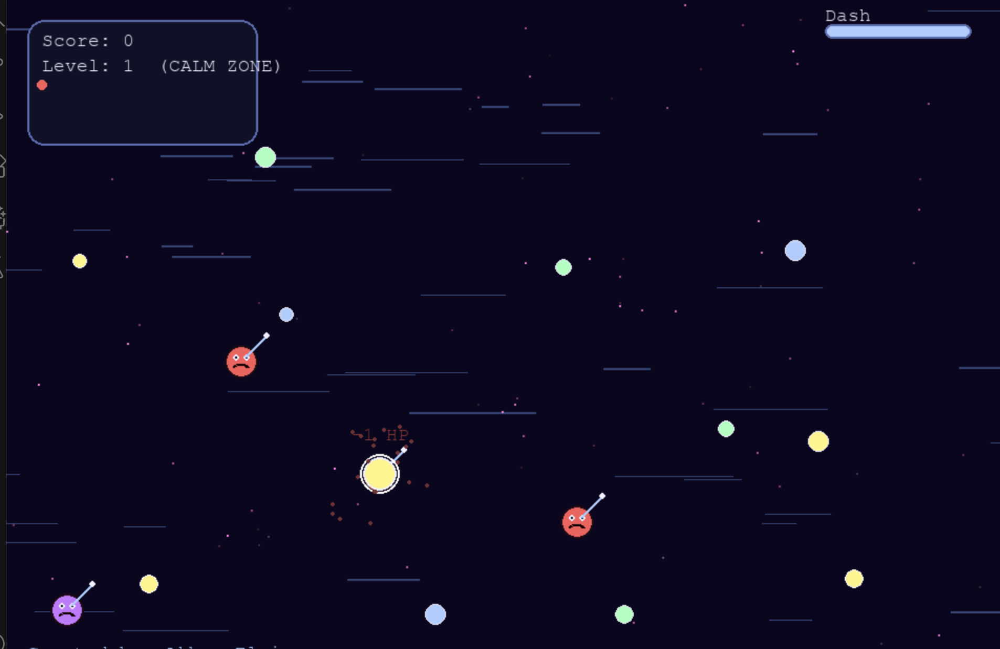

# Neon Arena

**Neon Arena** is a fast–paced, neon–styled survival game built with **Python** and **Pygame**.  
Dodge enemies, collect orbs, build combos, enter **Frenzy Mode**, and survive through increasingly difficult neon zones.

This project features multiple enemy patterns, dynamic level progression, visual effects, SFX, and a polished gameplay loop.

---

## 📸 Screenshots

### 🟣 Main Menu
The neon-themed main menu with difficulty selection, zone overview, and high score display.



---

### 🔥 Gameplay
Collect orbs, dash through enemies, survive attacks, and enter Frenzy Mode to boost your score.



---

## ✨ Features

### 💠 Neon Aesthetic
- Dynamic starfield background  
- Additive neon glow effects  
- Motion lines & sparkles  
- Dash afterimage trail  
- Color-coded zones for each difficulty level  

---

### ⚔️ Enemy Types
Each enemy has unique movement patterns:

| Type       | Color        | Behavior |
|------------|--------------|----------|
| **Chaser** | Red          | Directly rushes toward the player |
| **Orbiter** | Purple       | Circles around the player unpredictably |
| **Sniper** | Blue         | Locks on and fires laser shots after warnings |
| **Dasher** | Orange       | Charges rapidly when close |

Enemies grow faster and spawn more often as levels increase.

---

### 🟡 Orb Collection & Scoring
Each orb color grants different score values:

- Yellow → **+10**
- Blue → **+15**
- Green → **+20**
- Pink → **+30**

Additional mechanics:
- Higher zones grant **bonus points per orb**
- Collecting orbs quickly builds **combo**
- Combos increase score exponentially
- Missing or waiting too long resets combo timer

---

### 🔥 Frenzy Mode
Activated when reaching a high combo chain.

During **FRENZY MODE**:
- Score becomes **x2**
- Enemies **slow down**
- Screen gains an intense neon pink glow
- Big “FRENZY MODE – SCORE x2!” banner appears
- Creates a powerful, exciting gameplay moment

---

### 📈 Level & Zone Progression

| Level | Score Range | Zone Name     |
|-------|-------------|---------------|
| **1** | 0–99        | Calm Zone     |
| **2** | 100–249     | Hazard Zone   |
| **3** | 250–449     | Chaos Zone    |
| **4+** | 450+       | Overdrive     |

Leveling up grants:
- **+1 Heart**
- **+1 Shield**

Each zone increases enemy spawn rate, speed, and visual intensity.

---

### 💗 Health & Shield System
- Hearts represent the player’s HP  
- Shield absorbs damage before HP decreases  
- Level-ups restore or add more protection  

---

### 🔊 Sound Effects
The game includes custom SFX for:
- Dash  
- Orb pick-up  
- Player hit  
- Enemy burst  
- Level-up  
- Frenzy activation  

The sound engine gracefully handles missing files without crashing.

---

## 🎮 Controls

| Action        | Key |
|---------------|------|
| Move          | WASD / Arrow Keys |
| Dash          | SPACE |
| Pause         | P |
| Return to Menu | ESC |

---

## 🚀 Installation & Run

### Install dependencies

```bash
pip install -r requirements.txt
python3 main.py
